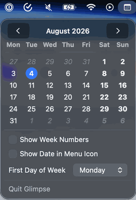

# Glimpse

A macOS menu bar calendar app — a modern port of [Quick View Calendar](https://quickviewcalendar.com/) for Apple Silicon.

The original Quick View Calendar is an Intel-only app that is no longer maintained. Glimpse replicates its core functionality and adds a few quality-of-life improvements.



## Features

- Monthly calendar popup from the menu bar
- Today highlighted with accent color
- Week numbers (toggleable)
- Configurable first day of week (Sunday, Monday, Saturday)
- Weekend days in bold, out-of-month days in italic
- Optional day number in the menu bar icon
- Launches at login
- macOS Tahoe (macOS 26) Liquid Glass support

## Requirements

macOS 13 or later

## Build

```bash
# Build Glimpse.app
./build-macos-app.sh

# Install to /Applications
./build-macos-app.sh --install
```

## Credits

Inspired by [Quick View Calendar](https://quickviewcalendar.com/) by [Jeffery Morgan](https://jeffreymorgan.io).
